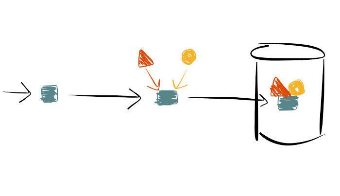

# Concurrent Data Pipelines

[Pipelined data processing](http://peter.bourgon.org/go-do/#24) example from Peter Bourgon's talk [Go Do](http://peter.bourgon.org/go-do).

Peter provides an example of a staged pipeline: a simple and clean model of subscribing to an event publisher (Listen), converting messages to enriched data models (Enrich), and feeding them into a data store (Store).

The example uses channels to pass ownership of a message between the various stages, which makes the program naturally concurrent.

The main functions (`Listen`, `Enrich`, `Store`) operate on the messages being passed through the channels (`a`, `b`, `c`) to form a pipeline: `Msg -> a -> b -> c`:

	  // channels for our pipeline (Msg -> a -> b -> c)
    a := make(chan Msg) // initial receiving channel
    b := make(chan Msg) // a -> b -> c
    c := make(chan Msg) // final outbound channel

    // wire the stages together, and launch each stage as a goroutine
    go Listen(a)
    go Filter(a, b)
    go Enrich(b, c)
    go Store(c)

Code samples correspond to the development sequence presented in the slide commentary:

* [`listen.go`](http://peter.bourgon.org/go-do/#25) - standalone listener 
* [`simple.go`](http://peter.bourgon.org/go-do/#26) - basic example
* [`filter.go`](http://peter.bourgon.org/go-do/#29) - adding a filtering stage
* [`scaled.go`](http://peter.bourgon.org/go-do/#31) - scaling up the
  concurrency
* [`http.go`](http://peter.bourgon.org/go-do/#32) - messages as incoming POST
  requests

When running [`http.go`](http.go), try issuing the following POST request:

    curl -d "data=hello" http://localhost:8080/incoming

This should return:

    OK: ☆ hello ☆

The [`multi-listen.go`](multi-listen.go) code sample is a slight modification
of `http.go`, where we listen for messages on two different routes and filter the messages
accordingly.
